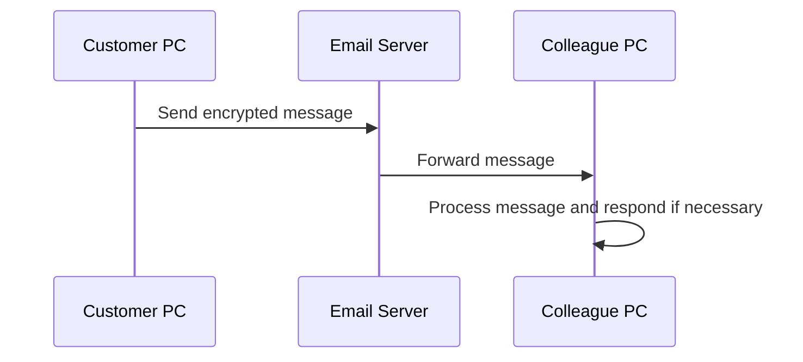

# NADOO Connect

## GPT

<https://chat.openai.com/g/g-YbUmf9xif-nadoo-connect-senior-dev>

## About the Project

NADOO Connect is an innovative solution that enables customers to send automated messages to our company using email-based communication. This project serves as a bridge between customer PCs and our company's system, focusing on simplicity, security, and efficiency.

## How It Works

NADOO Connect uses email as the primary communication channel to securely and efficiently transfer data and commands. Customer PCs send encrypted messages, which are received and processed by our system.

### Workflow Diagram

## Installation and Usage

(Detailed instructions for installation and usage of the software)

## License

This project is licensed under the MIT License. For more details, see the LICENSE file.

## Contributors

(List of contributors and their roles in the project)

For more information and support, please contact <support@nadooit.de>.
