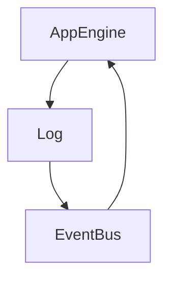

# Shopcloud-EventBus

Async Processing, write to Log an Event and send it to a Queue



## Usage

````sh
$ pip install shopcloud-eventbus
````

```sh
$ eventbus init
$ eventbus deploy
```

__Vanilla:__

````py
from shopcloud_eventbus import Event

event = Event(
    name="de.talk-point.platform/module/model/sync",
    model=self,
)
event.add_task(
    queue="default",
    url=f"module/api/model/{self.id}/action/",
    json={}
)
event.fire()
````

__Django__

use for example the  [shopcloud-django-toolbox](https://pypi.org/project/shopcloud-django-toolbox/) library

```py
from shopcloud_django_toolbox import Event

event = Event(
    name="de.talk-point.platform/module/model/sync",
    model=self,
)
event.add_task(
    queue="default",
    url=f"module/api/model/{self.id}/action/",
    json={}
)
event.fire()
```

## Install

### Services

```
$ gcloud services enable cloudtasks.googleapis.com --project="test-eventbus-project"
$ gcloud pubsub topics create events --project='test-eventbus-project'
$ gcloud tasks queues create default --project='test-eventbus-project' --location='europe-west3'
```

### Log Sink

Create a [log sink](https://console.cloud.google.com/logs/router/sink) with the following filter `resource.type="gae_app" "event-fire"`

```sh
$ eventbus --help
$ eventbus deploy
```

## Development

```sh
$ python3 setup.py install
$ python3 -m shopcloud_eventbus -d init --project="test-eventbus-project" --region="europe-west3" --app-endpoint="https://test-eventbus-project.ey.r.appspot.com" --secrethub-endpoint-user="talk-point/app-eventbus-test/production/evenbus-user" --secrethub-endpoint-pwd="talk-point/app-eventbus-test/production/evenbus-pwd"
$ python3 -m shopcloud_eventbus -d deploy
```

dann kann das Script getestet werden per

```sh
$ cd .eventbus
$ python3 -m venv venv
$ source venv/bin/activate
$ pip install -r requirements.txt
$ functions-framework --target main_http --debug
```

oder deployen und eine Test-Message durchsenden

```sh

```

### Deploy

```sh
$ rm -rf build dist
$ pip3 install wheel twine
$ python3 setup.py sdist bdist_wheel
$ twine upload dist/*
```
